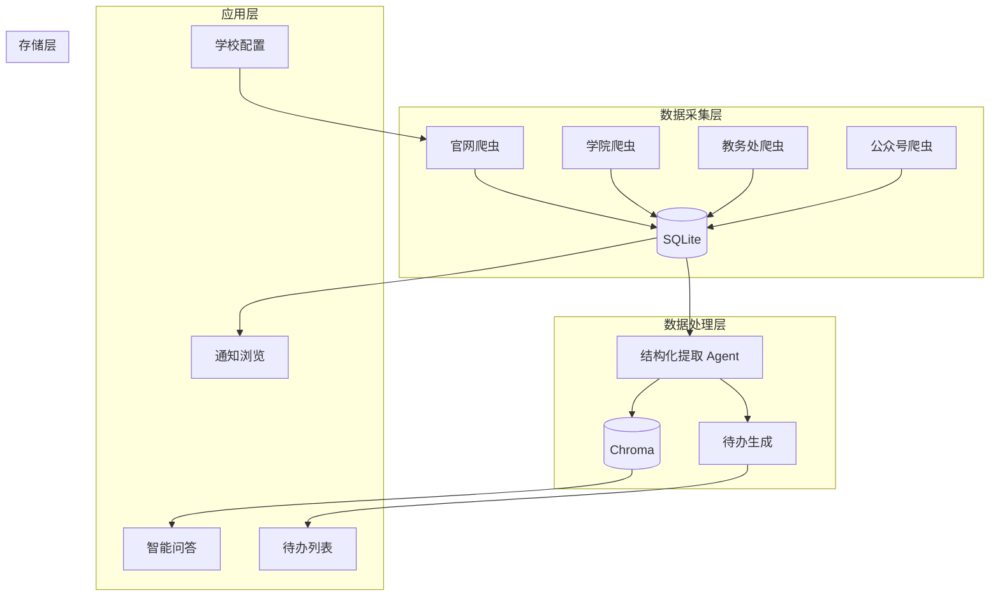
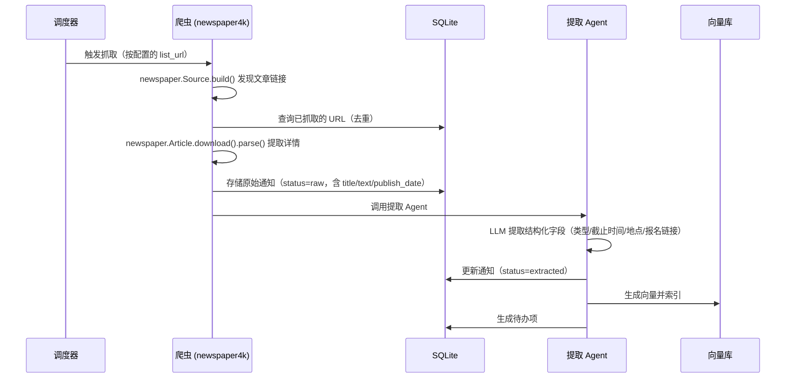
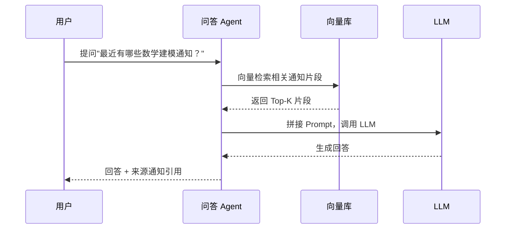

# 技术架构设计

## 1. 系统架构总览



## 2. 模块划分

```
campus_assistant/
├── config/              # 配置层（M6）
│   ├── app.yaml         # 应用主配置：模型/供应商/活跃学校
│   ├── schema.py        # Pydantic 配置模型
│   ├── store.py         # ConfigStore 单例加载器
│   ├── defaults.py      # 内置默认配置
│   └── schools/         # 学校数据源配置
│       └── scuec.yaml   # 中南民族大学配置
├── crawler/             # 通知抓取（基于 newspaper4k）
│   ├── base.py          # 爬虫基类（封装 newspaper.Source）
│   └── web_crawler.py   # 网页爬虫（列表页发现 + 详情页提取）
├── core/                # LLM 结构化提取（原计划 agents/，为避免与
│   │                    # OpenAI Agents SDK 的 agents 包重名而改名）
│   ├── models.py        # NoticeExtraction / KeyDate / TodoItem 模型
│   ├── date_utils.py    # 中文时间解析（deadline_raw -> ISO，年份推断）
│   ├── extractor.py     # 提取 Agent（output_type + 校验重试）
│   ├── todo.py          # 待办生成 Agent（M3，按需 generate_todos_for_notice）
│   └── qa.py            # RAG 问答 Agent（M4）
├── storage/             # 存储层
│   ├── db.py            # SQLite 操作（含 M2 schema 迁移 + todos 表）
│   ├── models.py        # 数据类模型
│   └── vectorstore.py   # Chroma 向量库（M4）
├── utils/               # 工具
│   ├── llm.py           # LLM 客户端（按任务从 ConfigStore 读取）
│   └── embedding.py     # Embedding 客户端（M4 + M6 配置化）
├── services/            # M5/M6 服务层：封装 M1-M4 能力供 UI 调用
│   ├── notice_service.py  # 爬取 + 提取 + 通知查询
│   ├── todo_service.py    # 待办查询/生成/状态更新
│   ├── qa_service.py      # 问答 + 向量索引管理
│   ├── config_service.py  # 配置读写 + 连通性测试
│   └── admin_service.py   # 通知/待办/索引 CRUD + 批量操作
├── ui/                  # 前端
│   └── todo_app.py      # M3 待办 Demo（保留，M5 提供完整替代）
├── pages/               # M5 Streamlit 多页面
│   ├── 1_📋_通知浏览.py  # 通知列表、爬取/提取、详情卡片
│   ├── 2_✅_待办清单.py  # 待办管理与生成
│   └── 3_💬_智能问答.py  # RAG 问答
├── crawl.py             # M1 入口：抓取通知
├── extract.py           # M2 入口：批量结构化提取
├── todo.py              # M3 入口：待办生成/列表/状态管理
├── index.py             # M4 入口：构建/更新 Chroma 向量索引
├── qa.py                # M4 入口：RAG 问答
├── evaluate_extraction.py  # M2 验收：黄金集评估
└── app.py               # M5 入口：Streamlit 仪表盘首页
```

> **爬虫层说明**：不再自己写 BeautifulSoup 选择器，改用 `newspaper4k` 库。
> - `Source` 类负责列表页 → 自动发现文章链接
> - `Article` 类负责详情页 → 自动提取标题/正文/发布日期/作者
> - `crawler/base.py` 只需封装 newspaper4k + 配置加载 + 去重逻辑

## 3. 核心数据流

### 3.1 通知抓取与提取流程



> **M5 实现**：上述"调度器"由 Streamlit UI 页面 (`pages/1_📋_通知浏览.py`) 中的按钮承担，用户点击后调用 `services/notice_service.py` 的 `crawl_all_sources()` / `extract_batch()`，提取成功后自动调用 `VectorIndex.add_notice()` 增量索引。

### 3.2 问答流程



## 4. 关键技术选型理由

### 4.1 为什么用 OpenAI Agents SDK

- Capstone 课程要求
- 提供 Agent、Tool、Handoff、Session 等抽象
- 支持 `output_type` 结构化输出，适合通知提取

### 4.2 为什么 LLM 用 opencode-go

- 无 OpenAI 官方 key
- opencode-go 兼容 OpenAI 接口
- Kimi K2.7 Code 中文理解能力强

### 4.3 为什么 Embedding 用本地模型

- opencode-go 不支持 embedding API（已验证）
- `all-MiniLM-L6-v2` 仅 90MB，CPU 可跑
- 384 维向量，检索质量足够

### 4.4 为什么用 SQLite + Chroma

- MVP 单机运行，无需独立数据库服务
- SQLite 单文件，便于备份和迁移
- Chroma 嵌入式，与 SQLite 配合简单

### 4.5 为什么爬虫用 newspaper4k（新增）

- **不重复造轮子**：列表页发现 + 详情页提取是通用场景，已有成熟库
- `newspaper4k`（1.1k stars，活跃维护）是 `newspaper3k`（15k stars）的延续 fork
- `Source` 类自动发现文章链接，启发式过滤非文章页面
- `Article` 类自动提取标题/正文/发布日期/作者，支持中文
- 自带去重（`memorize_articles` + SHA-256 内容指纹）
- 把 M1 工作量从 2 天降到 0.5-1 天

## 5. Agent 设计

### 5.1 结构化提取 Agent

```python
from agents import Agent
from pydantic import BaseModel

class NoticeExtraction(BaseModel):
    title: str
    notice_type: str  # competition/lecture/...
    deadline: str | None  # ISO 8601
    location: str | None
    target_audience: str | None
    registration_url: str | None
    summary: str
    key_dates: list[str]

extractor_agent = Agent(
    name="通知提取助手",
    instructions="从通知正文中提取结构化信息...",
    output_type=NoticeExtraction,
)
```

### 5.2 问答 Agent

实现文件：`core/qa.py`。流程：

1. `VectorIndex.search(question)` 检索 Top-K 相关 chunk
2. 按 `notice_id` 去重，编号 `[1]..[n]` 拼入 Prompt
3. 调用 OpenAI Agents SDK 的 Agent 生成回答
4. 来源通知从检索 metadata 确定性导出（标题 + URL），避免 LLM 幻觉引用

```python
qa_agent = Agent(
    name="通知问答助手",
    instructions="仅基于提供的参考通知回答问题，并用 [编号] 引用来源",
)
```

### 5.3 待办生成 Agent

```python
todo_agent = Agent(
    name="待办生成助手",
    instructions="从通知中生成可执行的待办项",
    output_type=TodoList,
)
```

## 6. 配置设计（M6）

配置拆分为应用级与学校级两层：

```yaml
# config/app.yaml：应用主配置
active_school: scuec

models:
  extraction: { provider: opencode-zen, model: kimi-k2.7-code }
  qa:         { provider: opencode-zen, model: deepseek-v4-pro }
  todo:       { provider: opencode-zen, model: kimi-k2.7-code }
  embedding:  { provider: local, model: all-MiniLM-L6-v2 }

providers:
  opencode-zen:
    name: opencode-zen
    base_url: https://opencode.ai/zen/go/v1
    api_key_env: OPENCODE_API_KEY
  local:
    name: local
    base_url: ""
    api_key_env: ""

crawl:
  interval_minutes: 60
  user_agent: CampusAssistant/1.0
  max_pages: 5
```

```yaml
# config/schools/scuec.yaml：学校数据源配置
name: 中南民族大学
code: scuec

sources:
  - name: 创新创业学院-竞赛通知
    type: web
    list_url: https://www.scuec.edu.cn/cxcy/scss/jstz.htm
    max_pages: 5

  - name: 教务处-管理文件
    type: web
    list_url: https://www.scuec.edu.cn/jwc/glwj.htm
    max_pages: 5
```

配置加载流程：
1. `config/store.py` 读取 `config/app.yaml`，失败则回退到 `.bak`，再失败使用内置默认值
2. 通过 `active_school` 字段加载 `config/schools/<code>.yaml`
3. API Key 通过 `provider.api_key_env` 引用 `.env` 中的环境变量
4. 保存配置时自动备份旧文件到 `.bak`，并通过 `version` 计数器驱动 embedding / agent 缓存失效

## 7. 错误处理策略

| 场景         | 处理                                       |
| ------------ | ------------------------------------------ |
| 网页抓取失败 | 重试 3 次，记录失败日志                    |
| LLM 调用限流 | 指数退避重试（已在 RAG 项目验证）          |
| 提取结果为空 | 保留原始通知，标记 `status=extract_failed` |
| 向量索引失败 | 不阻塞主流程，记录日志                     |
| newspaper4k 提取失败 | 保留原始 HTML，标记 `status=parse_failed` |

## 8. 演进路线

| 阶段   | 架构变化                           |
| ------ | ---------------------------------- |
| MVP    | 单进程，SQLite + Chroma 本地       |
| 多用户 | 加 Web 框架（FastAPI），PostgreSQL |
| 生产   | Docker 部署，定时任务独立，加缓存  |

## 9. 参考项目（新增）

| 项目 | 仓库 | 借鉴点 |
|------|------|--------|
| newspaper4k | [AndyTheFactory/newspaper4k](https://github.com/AndyTheFactory/newspaper4k) | 爬虫核心库：Source 发现链接 + Article 提取内容 |
| newspaper3k | [codelucas/newspaper](https://github.com/codelucas/newspaper) | newspaper4k 的前身，15k stars，文档丰富 |
| CampusMate.AI | [nisargpatel1906/CampusMate.AI](https://github.com/nisargpatel1906/CampusMate.AI) | 同类项目参考：大学通知抓取 + RAG 问答，BFS 爬虫 + 关键词分类 |
| Llama 3.1 本地 RAG | 本地项目 `../Llama 3.1 本地 RAG` | RAG 链路、embedding fallback、限流重试的前身 |