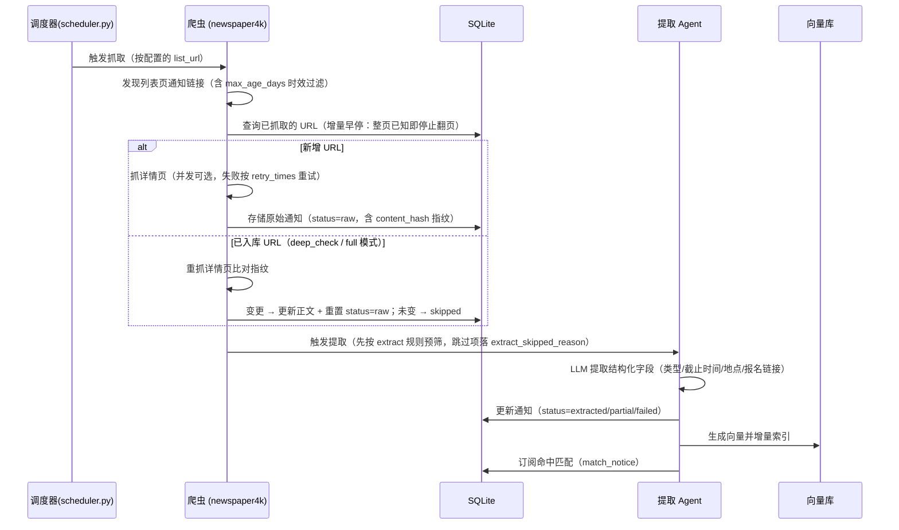
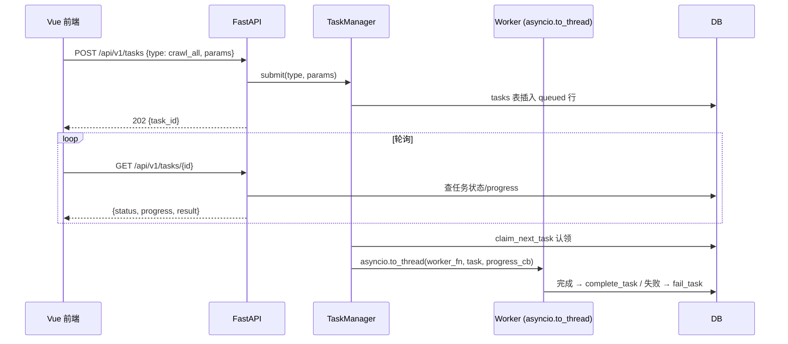
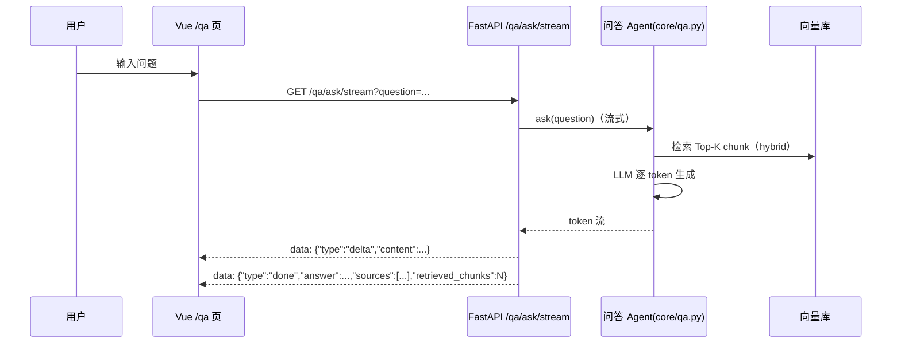
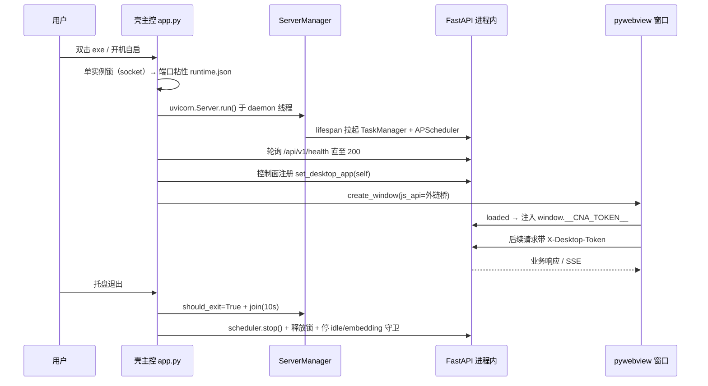

# 技术架构设计

> 维护说明：本文档描述**当前**的前后端分离架构（FastAPI + Vue3），以及其上的桌面壳运行时
> （pywebview，见 `desktop/`）。MVP 时代的 Streamlit 界面（`app.py` + `pages/`）已在
> Phase 0–8 重构中被替换，拆分前的历史盘点见
> `docs-local/长线开发/现状盘点与前后端分离前置.md`。
>
> **文档分工**：本文档聚焦**模块划分细节 + API 端点清单 + 配置项全表**；
> 面向全局的架构视图（分层、数据流、设计决策、桌面/Web 双形态）见
> [SYSTEM-DESIGN.md](SYSTEM-DESIGN.md)。

## 1. 系统架构总览

```mermaid
graph TB
    subgraph 壳层 desktop/ (pywebview 原生窗口, Windows)
        SH1[app.py 壳主控<br/>单实例·端口粘性·看门狗·托盘]
        SH2[server.py<br/>uvicorn daemon 线程托管]
        SH3[tray / autostart / idle / backup / updater]
    end

    subgraph 前端 frontend/ (Vue3 + Naive UI)
        F1[/ / 首页/]
        F2[/ /notices 通知浏览/]
        F3[/ /todos 待办中心/]
        F4[/ /qa 智能问答 SSE/]
        F5[/ /config 系统配置/]
        F6[/ /subscriptions 订阅管理/]
        F7[/ /market 服务市场/]
        F8[/ /sources 数据源中心/]
        F9[/ /notifications 通知中心/]
    end

    subgraph 后端 api/ (FastAPI, /api/v1)
        A[路由模块<br/>14 个：notices/todos/reminders/subscriptions<br/>config/qa/events/tasks/scheduler/usage<br/>source_center/update/desktop + system health]
        B[api/tasks TaskManager<br/>异步任务 202→轮询]
        C[scheduler (APScheduler)<br/>lifespan 拉起 6 job]
        D[deps 鉴权占位 + desktop_token 令牌校验]
    end

    subgraph 业务服务层 services/ (13 个)
        S1[notice_service]
        S2[todo_service]
        S3[qa_service]
        S4[subscription_service]
        S5[reminder_service]
        S6[config_service]
        S7[admin_service]
        S8[tracking_service]
        S9[health_service]
        S10[usage_service]
        S11[source_center_service]
        S12[embedding_model_service]
        S13[update_service]
    end

    subgraph 引擎层
        E1[core/ LLM Agent<br/>extractor/todo/qa/date_utils]
        E2[storage/ SQLite + Chroma + hybrid]
        E3[crawler/ newspaper4k]
        E4[config/ Pydantic + YAML]
        E5[utils/ llm.py + embedding.py]
    end

    SH1 --> SH2
    SH2 -->|托管| A
    SH1 -.控制面 /desktop/*.-> A
    F1 --> A
    F2 --> A
    F3 --> A
    F4 --> A
    F5 --> A
    F6 --> A
    F7 --> A
    F8 --> A
    F9 --> A
    A --> S1
    A --> S2
    A --> S3
    A --> S4
    A --> S5
    A --> S6
    A --> S7
    A --> S8
    A --> S9
    A --> S10
    A --> S11
    A --> S12
    A --> S13
    S1 --> E1
    S2 --> E1
    S3 --> E1
    S3 --> E2
    S4 --> E2
    S5 --> E2
    S7 --> E2
    S11 --> E4
    S13 --> E4
    E1 --> E5
    E1 --> E4
    E2 --> E4
    E3 --> E4
    C --> S1
    C --> S3
    C --> S5
    C --> S9
```

## 2. 模块划分

```
campus_notice_assistant_v2/
├── api/                    # FastAPI 后端（Phase 1–6）
│   ├── main.py             # 应用工厂 create_app：CORS + include_router + lifespan + 静态挂载
│   ├── deps.py             # 鉴权占位依赖（CAMPUS_API_KEY 环境变量，默认关闭）
│   ├── desktop_token.py    # 桌面启动令牌中间件（K7，B11；health 探针豁免）
│   ├── schemas.py          # pydantic 响应模型（services dict → model_validate，无转换器）
│   ├── routes/             # 14 个路由模块（prefix 均含 /api/v1）
│   │   ├── notices.py      #   通知只读 + 数据管理
│   │   ├── todos.py        #   待办 + /notices/{id}/todos 子路由
│   │   ├── reminders.py    #   截止提醒
│   │   ├── subscriptions.py#   订阅 + 两步式 preview/confirm
│   │   ├── config.py       #   配置读写（GET/PUT + reload + test-source/test-model）
│   │   ├── qa.py           #   问答 SSE 流式 + 索引状态
│   │   ├── events.py       #   埋点上报
│   │   ├── tasks.py        #   异步任务提交/轮询（202 → task_id）
│   │   ├── scheduler.py    #   调度器状态查询
│   │   ├── usage.py        #   Token 用量统计
│   │   ├── source_center.py#   数据源中心（公共目录 + 一键选用）
│   │   ├── update.py       #   更新检查（latest.json）
│   │   └── desktop.py      #   桌面控制面（设置/状态/调度暂停，B11+B15）
│   └── tasks/              # 异步任务化（Phase 4）
│       ├── manager.py      #   asyncio 单 worker + 进度回调 + 重启恢复
│       ├── lock.py         #   compute_lock_key：任务锁幂等去重
│       └── workers.py      #   WORKERS 注册表：task type → 业务函数
├── desktop/                # 桌面壳运行时（v0.2.0，Windows x64）
│   ├── __main__.py         #   壳入口（console=False 打包，裸 exe 双击启动）
│   ├── app.py              #   壳主控：单实例 → 端口粘性 → 起后端 → 等 health → 建窗口
│   ├── server.py           #   uvicorn 托管到 daemon 线程（禁用 uvicorn.run，K2）+ 端口粘性 K1
│   ├── config.py           #   ShellSettings（窗口几何/自启/关闭行为/空闲阈值，settings.json）
│   ├── single_instance.py  #   单实例锁（socket，B07）+ 唤起回调
│   ├── tray.py             #   pystray 托盘（打开/退出/日志/暂停调度/检查更新）
│   ├── autostart.py        #   HKCU Run 注册表自启开关（B13）
│   ├── idle.py             #   空闲重活 gate（GetLastInputInfo + 电池感知，B14）
│   ├── embedding_guard.py  #   嵌入模型空闲释放守卫（B21，内存优化）
│   ├── backup.py           #   SQLite backup API 一致性快照 + 每周判频保留 3 份（B17）
│   ├── updater.py          #   更新闭环：latest.json + sha256 + 确认装（B18）
│   ├── logging_setup.py    #   日志落盘 + 崩溃转储 write_crash_report（B05）
│   ├── shutdown_hook.py    #   WM_QUERYENDSESSION 关机钩子（B08）
│   └── webview_hooks.py    #   外链拦截 js_api 桥 + 令牌注入（B10/B11）
├── frontend/               # Vue3 前端（Phase 7）
│   ├── src/
│   │   ├── api/            #   endpoints.ts / http.ts / tasks.ts / events.ts / qa.ts
│   │   │                   #   types.ts（openapi-typescript 生成）/ schema.ts（契约别名）
│   │   ├── router/         #   9 路由 + page_view 埋点守卫
│   │   ├── stores/         #   10 个 Pinia store（notices/todos/reminders/subscriptions/
│   │   │                   #   config/qa/task/notifications/sourceCenter/theme）
│   │   ├── composables/    #   useAsync.ts / useTaskPoll.ts
│   │   ├── utils/          #   openExternal.ts（外链统一）/ clipboard.ts（降级链）/ format.ts
│   │   ├── views/          #   Home / Notices / Todos / Qa / Config / Subscriptions / Market
│   │   │                   #   / DataSourceCenter / Notifications（共 9 个页面）
│   │   └── App.vue         #   NLayout 侧栏 + RouterView
│   ├── openapi.json        #   契约文件（gen:api 的唯一输入）
│   └── vite.config.ts      #   NaiveUiResolver 按需导入 + /api 代理到 8000
├── services/               # 业务编排层（13 个服务，全部同步函数，返回 dict/标量）
│   ├── notice_service.py   #   爬取/提取编排中枢 + 通知查询
│   ├── todo_service.py     #   待办查询/生成/状态更新/PATCH 编辑
│   ├── qa_service.py       #   问答 + 向量索引管理
│   ├── subscription_service.py  # 订阅规则引擎 + 命中维护
│   ├── reminder_service.py #   截止提醒扫描
│   ├── config_service.py   #   配置读写 + 连通性测试
│   ├── admin_service.py    #   通知 CRUD + 批量操作 + 索引重建
│   ├── tracking_service.py #   埋点
│   ├── health_service.py   #   每日体检
│   ├── usage_service.py    #   token 用量统计
│   ├── source_center_service.py    # 数据源中心（公共目录 + 判重联动）
│   ├── embedding_model_service.py  # 本地 embedding 模型管理
│   └── update_service.py   #   更新检查契约（壳 updater 复用）
├── core/                   # LLM Agent 层（与 OpenAI Agents SDK 的 agents 包同名，故用 core/）
│   ├── models.py           # NoticeExtraction / KeyDate / TodoItem 模型
│   ├── date_utils.py       # 中文时间解析（deadline_raw -> ISO，年份推断）
│   ├── extractor.py        # 提取 Agent（output_type + 校验重试）
│   ├── todo.py             # 待办生成 Agent（模板兜底）
│   └── qa.py               # RAG 问答 Agent
├── storage/                # 数据层
│   ├── db.py               # SQLite（13 张表 + 迁移 + 断点续跑 + WAL pragma）
│   ├── models.py           # 数据类模型
│   ├── vectorstore.py      # Chroma 向量库 + 过期三档 + 一致性校验
│   └── hybrid.py           # 混合检索（BM25+RRF）
├── crawler/                # 抓取层（newspaper4k）
│   ├── base.py             # 爬虫基类（Source 发现链接 + Article 提取详情）
│   └── web_crawler.py      # 网页爬虫 + 内容指纹变更检测
├── config/                 # 配置层
│   ├── app.yaml            # 应用主配置（models/providers/crawl/scheduler）
│   ├── schema.py           # Pydantic 配置模型
│   ├── store.py            # ConfigStore 单例（三层 fallback + 原子写）
│   ├── defaults.py         # 内置默认配置
│   ├── schools/            # 学校数据源配置（scuec.yaml）
│   └── source_catalog.yaml # 公共数据源目录（112 校内数据源）
├── utils/
│   ├── llm.py              # LLM 唯一调用点（run_agent + 失败切换 + token 计量）
│   ├── embedding.py        # Embedding 唯一调用点（本地 + OpenAI-compatible 两路）
│   └── app_paths.py        # 应用路径解析（数据目录三态 dev/portable/installed）
├── scheduler.py            # APScheduler（6 job，可由 lifespan 或 CLI 拉起）
├── desktop_main.py         # 桌面壳入口（打包 Nuitka/PyInstaller 的 entry）
├── crawl.py / extract.py / index.py / qa.py / todo.py   # CLI 入口（保留，复用 services）
├── check_db.py             # 每日体检 CLI
├── check_vector_consistency.py  # 向量一致性检查
├── evaluate_*.py           # 提取/检索/过期/混合/待办评测
├── tools/                  # seed_demo_data.py / demo_reminder.py（造数/演示）
├── test_*.py               # 43 个离线验收测试（含 10 个 test_desktop_*）
├── packaging/              # build.py（PyInstaller/Nuitka）+ Inno Setup + venv-build
├── Dockerfile              # Multi-stage（Node 构建 → Python 运行时）
├── requirements.txt        # 引擎/开发依赖
├── requirements-backend.txt# 运行镜像最小包
└── requirements-dev.txt    # 开发依赖
```

> **爬虫层说明**：使用 `newspaper4k` 库（`Source` 类列表页发现 + `Article` 类详情页提取），
> 不再手写 BeautifulSoup 选择器。

## 3. 核心数据流

### 3.1 通知抓取与提取流程



> **调度/手动双入口**：调度器 `crawl`/`extract` job 自动执行；前端「抓取 / 深度抓取 / 批量提取」按钮经
> 异步任务（202 → `GET /tasks/{id}` 轮询）触发，支持按来源多选 / 模式覆盖（incremental/full/list_only）/
> 页数覆盖 / 深度检查开关。

> **增量策略（阶段 7）**：常规轮次只抓「新 URL」详情页，已入库通知不重抓；内容变更检测改为
> 周期深检（`crawl.deep_check_interval_cycles` 轮一次，默认 24 ≈ 每日）与手动「深度抓取」两条路径。
> 提取侧用规则预筛把空页面/占位页/无关通知挡在 LLM 之外（默认仅开启正文长度下限，行为宽松向后兼容）。

### 3.2 异步任务模型（Phase 4）



### 3.3 问答 SSE 流式（Phase 5）



### 3.4 埋点数据流

- 前端路由守卫发 `page_view`；页面行为发 `qa_ask` / `todo_generate` / `todo_done` / `service_button_click`。
- 全部经 `POST /api/v1/events` → `services/tracking_service.track_event`（独立短连接、try/except 兜底，写库失败返回 ok=false，不阻塞主流程）。

### 3.5 桌面壳数据流（v0.2.0）



> **令牌链路（K7）**：壳生成 `secrets.token_urlsafe(32)` → 写 `CNA_DESKTOP_TOKEN` 环境变量 +
> `set_desktop_app` 注册 → webview `loaded` 后注入 `window.__CNA_TOKEN__` → 前端 http client
> 读该变量加 `X-Desktop-Token` 头 → 后端中间件校验（`/api/v1/health` 探针豁免）。
> **必须在 loaded 后注入**：`start()` 前 GUI 未启动，`evaluate_js` 会超时失败（B22 修复）。

> **端口粘性（K1）**：localStorage 按 origin（含端口）分区，端口漂移会丢 QA 会话 / 主题设置。
> 上次成功端口写 `data/runtime.json`，启动优先复用，失败才顺序探测并写回。

## 4. 关键技术选型理由

### 4.1 为什么用 OpenAI Agents SDK

- Capstone 课程要求；提供 Agent、Tool、Handoff、Session 抽象；`output_type` 结构化输出适合通知提取。

### 4.2 LLM / Embedding 供应商（可配置）

- 通过 `config/app.yaml` 的 `providers` 注册表配置（当前：bailian 阿里云百炼 qwen3.7-max）。
- Embedding 用本地模型 `models/bge-small-zh-v1.5`（bge 中文效果优于 all-MiniLM-L6-v2）。

### 4.3 为什么用 SQLite + Chroma

- MVP 单机运行无需独立数据库服务；`storage/` 已抽象，未来 PG 只改 storage 实现。

### 4.4 为什么前后端分离（FastAPI + Vue3）

- 长时操作（爬取/提取/问答）同步阻塞问题 → 异步任务化（tasks + 轮询）与 SSE 流式。
- Streamlit session_state 承载交互状态（两步式）→ 平移为「后端 preview/confirm API + 前端路由状态」。
- 契约对齐：openapi.json 是唯一对齐点，`openapi-typescript` 生成 `src/api/types.ts` 零漂移。
- 架构为后续 APP 端 / 多用户预留拓展位（api/deps.py 鉴权替换点）。

### 4.5 为什么在 Web 之上加桌面壳（v0.2.0）

- **目标**：免终端、免手动开浏览器的原生 PC 体验（双击即用），面向非技术用户分发。
- **不改后端**：75 个 REST 端点零改动，壳只在进程编排层包裹（起后端 → 等 health → 嵌 webview）。
- **选 pywebview 不选 Electron/Tauri**：复用既有 Vue 产物与 WebView2（Win11 内置），壳增量仅 44.6MB；
  Electron 体积过大，Tauri 需重写前端集成层。
- **单进程模型**：uvicorn 跑在 daemon 线程（**禁用 `uvicorn.run()`**——它装 signal handler，
  非主线程抛 `set_wakeup_fd only works in main thread`），必须用 `uvicorn.Config + Server` 实例。
- **降级路径**：`--browser`（跳过 webview 用系统浏览器）、`--no-tray`（关闭即退出）两条回滚点。

## 5. Agent 设计

### 5.1 结构化提取 Agent

```python
from agents import Agent
from pydantic import BaseModel

class NoticeExtraction(BaseModel):
    title: str
    notice_type: str  # competition/lecture/...
    deadline: str | None  # ISO 8601
    location: str | None
    target_audience: str | None
    registration_url: str | None
    summary: str
    key_dates: list[str]

extractor_agent = Agent(
    name="通知提取助手",
    instructions="从通知正文中提取结构化信息...",
    output_type=NoticeExtraction,
)
```

### 5.2 问答 Agent

实现文件：`core/qa.py`。流程：

1. 混合检索（`storage/hybrid.py`）Top-K chunk
2. 按 `notice_id` 去重，编号 `[1]..[n]` 拼入 Prompt
3. 调用 OpenAI Agents SDK 的 Agent 生成回答（流式）
4. 来源通知从检索 metadata 确定性导出（标题 + URL），避免 LLM 幻觉引用

### 5.3 待办生成 Agent

实现文件：`core/todo.py`，`output_type=TodoList`，失败时 `template_fallback` 确定性兜底。

## 6. 配置设计（M6 + Phase 3）

配置拆分为应用级与学校级两层（`config/app.yaml` + `config/schools/scuec.yaml`）：

```yaml
active_school: scuec
models:
  # models 为有序候选列表（同供应商内失败切换）：先尝试在前，失败自动切下一个
  extraction: { provider: bailian, models: [qwen3.7-flash, qwen3.7-max] }
  qa:         { provider: bailian, models: [qwen3.7-flash, qwen3.7-max] }
  todo:       { provider: bailian, models: [qwen3.7-flash, qwen3.7-max] }
  embedding:  { provider: local, models: [models/bge-small-zh-v1.5] }
providers:
  bailian:  { name: bailian,  display_name: 阿里云百炼, base_url: https://dashscope.aliyuncs.com/compatible-mode/v1, api_key_env: DASHSCOPE_API_KEY, models: [qwen3.7-flash, qwen3.7-turbo, qwen3.7-max], type: bailian }
  local:    { name: local,    display_name: 本地模型,   base_url: "", api_key_env: "", models: [models/bge-small-zh-v1.5], type: local }
crawl:
  interval_minutes: 60
  cleanup_enabled: false
  expire_days: 90
  stop_when_caught_up: true    # 增量早停：整页已知即停止翻页
  request_timeout: 15          # 详情页请求超时（秒）
  retry_times: 2               # 详情页失败重试次数（指数退避）
  concurrency: 1               # 详情页并发数（1-8；写库回主线程，规避 SQLite 线程约束）
  deep_check_interval_cycles: 24  # 每 N 轮自动深检一轮全来源内容变更；0 = 关闭
extract:
  batch_limit: 50              # 单批上限
  min_content_length: 100      # 正文长度下限（过滤空页面/占位页）
  max_age_days: null           # 只提取最近 N 天发布（发布时间缺失回退抓取时间）；null = 不限
  keyword_filter: null         # 仅含关键词（逗号分隔，标题+正文）
  skip_keywords: null          # 排除关键词（标题命中即跳过）
  require_time_hint: false     # 必须含时间线索（日期/报名/截止等）
  match_subscription_only: false  # 仅提取至少命中一条订阅的通知
  retry_failed: true           # 每轮顺带重试 status=failed 的通知
  skip_llm: false              # 跳过 LLM 提取：仅入库 + 建索引，状态置 partial（省 token 模式）
scheduler:
  enabled: true        # API lifespan 是否拉起调度器
  enable_daily: true   # 过期清理 + 向量一致性检查
  enable_extract: true
  enable_reminder: true
  enable_health: true
```

数据源配置（`config/schools/<code>.yaml`）来源级策略：

```yaml
sources:
  - name: 教务处-通知公告
    list_url: https://www.scuec.edu.cn/jwc/tzgg.htm
    url_pattern: "info/\\d+/\\d+\\.htm"
    enabled: true              # 停用后定时/全量抓取跳过
    crawl_mode: incremental    # incremental / full / list_only
    max_age_days: null         # 只抓最近 N 天；null = 不限
    fetch_detail: true         # false = 仅收录列表标题/链接
    deep_check: false          # 是否参与周期/手动深度检查
    max_pages: 5
```

配置加载与写入（见 `config/store.py`）：

1. 加载：`app.yaml` → `.bak` → 内置默认值，三层 fallback；版本号缓存失效。
2. 写入：`_backup_and_write` 三步原子写（`.tmp → .bak → os.replace`）。
3. **写入权唯一归后端 API 进程**（§5.8 并发语义）：调度器/CLI 只读，`force_reload_config` 后重载；多写者需加文件锁。

## 7. API 契约（/api/v1）

> 单一事实源：`frontend/openapi.json`（后端导出），前端 `npm run gen:api` 生成 `src/api/types.ts`。

| 模块 | 主要端点 | 说明 |
| --- | --- | --- |
| notices | `GET /notices`（分页信封）、`GET /notices/{id}`、`GET /notices/status-counts`、`GET /notices/meta`、`GET /notices/sources`、`GET /notices/types` | 只读浏览 + 元信息 |
| notices 管理 | `DELETE /notices/{id}`、`POST /notices/{id}/reset`、`POST /notices/{id}/re-extract`（任务）、`POST /notices/batch-delete`（任务）、`POST /notices/batch-reset`（任务）、`POST /notices/extract-preview`（dry-run 预筛，返回将提取/跳过明细及原因） | CRUD + 提取预览 |
| todos | `GET /todos`、`GET /todos/stats`、`POST /todos/{id}/status`、`PATCH /todos/{id}`（action/due_at/notes）、`POST /notices/{id}/todos`（任务）、`GET /notices/{id}/todos` | 待办中心 |
| reminders | `GET /reminders`、`GET /reminders/stats`、`GET /reminders/pending-count`、`POST /reminders/{id}/status` | 截止提醒 |
| subscriptions | `GET /subscriptions`、`GET /subscriptions/stats`、`POST /subscriptions/preview`、`POST /subscriptions`（任务）、`PUT /subscriptions/{id}`（任务）、`POST /subscriptions/{id}/toggle`（任务）、`DELETE /subscriptions/{id}`、`POST /subscriptions/match-all`（任务）、`GET /subscriptions/{id}/notices` | 两步式订阅 |
| notices 订阅 | `GET /notices/count`、`GET /notices/matched-ids`、`POST /notices/match-map` | 浏览页命中徽标 |
| config | `GET/PUT /config/{models,providers,sources,crawl,extract}`、`GET /config/disk`、`POST /config/reload`、`POST /config/test-source`（含 `suggested_pattern` 自动填充）、`POST /config/test-model`（成功/失败均记 `token_usage task=test`）、`PUT /config/providers/{name}/api-key`（写入 `.env` + 同步环境变量） | 配置 |
| usage | `GET /usage/tokens?days=N`（默认 7，1–365；按 task×provider×model 分组，含 `task_label`） | Token 用量 |
| qa | `GET /qa/ask/stream`（SSE）、`GET /qa/index-stats` | 问答 |
| events | `POST /events` | 埋点 |
| tasks | `POST /tasks`（202）、`GET /tasks/{id}`、`GET /tasks` | 异步任务 |
| scheduler | `GET /scheduler/status` | 调度器状态 |
| source_center | `GET /source-center/catalog`、`GET /source-center/tree`、`POST /source-center/adopt` | 数据源中心（112 校内数据源目录 + 一键选用） |
| update | `GET /update/check` | 更新检查（latest.json） |
| desktop | `GET /desktop/status`、`GET/PUT /desktop/settings`、`POST /desktop/scheduler`、`POST /desktop/export-logs`、`POST /desktop/open-external` | 桌面控制面（B11+B15；需令牌） |
| system | `GET /health` | 健康检查（探针豁免令牌） |

## 8. 错误处理策略

| 场景 | 处理 |
| --- | --- |
| 网页抓取失败 | 按 `crawl.retry_times` 指数退避重试（默认 2 次），记录失败日志（crawl_log） |
| LLM 调用限流 | 指数退避重试（已在 RAG 项目验证） |
| 提取结果为空 | 保留原始通知，标记 `status=failed` |
| 提取前置过滤 | 不调 LLM，落 `extract_skipped_reason`，状态保持 raw（可重置/变更后恢复候选）；时效按发布时间（缺失回退抓取时间） |
| 提取预览 | `POST /notices/extract-preview` dry-run 预筛，不落库不改状态；前端勾选后提交 `notice_ids`（显式勾选跳过预筛） |
| 跳过 LLM 提取 | `config.extract.skip_llm=true`：不调 LLM，仅订阅匹配 + 建索引，状态置 partial（仅索引未结构化） |
| 向量索引失败 | 不阻塞主流程，记录日志（旧 chunk 已删，每日体检一致性重建兜底） |
| 长耗时操作 | 异步任务化（202 + 轮询），失败落 tasks.error |
| 埋点写库失败 | 只记日志返回 ok=false，不阻塞主流程 |
| 调度 job 失败 | 不吞异常，落 scheduler_log（含连续失败计数） |
| 桌面令牌缺失/失效 | 中间件返回 401；壳注入失败仅记日志（此时校验默认关闭，降级放行） |
| 后端启动未就绪 | 壳轮询 health 超时 30s → 记错误并退出（`--browser` 同理） |
| 窗口关闭 vs 退出 | `window.destroy()` 也触发 closing → 必须先置 `_exiting=True` 放行，否则 `webview.start()` 永不返回 |
| 托盘不可用 | 降级为「关闭即退出」，`_tray_available=False`（`--no-tray` 强制此路径） |
| 单实例冲突 | 第二实例不发窗口，向持锁实例发唤起指令后自身退出（R7） |
| 系统关机 | `WM_QUERYENDSESSION` 钩子走统一退出序列，不弹确认框（避免阻塞关机） |

## 9. 演进路线

| 阶段 | 架构变化 | 状态 |
| --- | --- | --- |
| MVP | 单进程，SQLite + Chroma 本地，Streamlit | ✅ 完成 |
| 短线开发 W1–W4 | 调度器、检索质量、订阅提醒、埋点体检 | ✅ 完成 |
| 前后端分离 | FastAPI + Vue3 + 异步任务 + SSE + Docker | ✅ 完成 |
| 工程优化 | 增量抓取、提取预筛、模型失败切换、Token 计量、问答缓存、数据源中心 | ✅ 完成 |
| 桌面化 v0.2.0 | pywebview 原生壳 + 托盘/单实例/自启/更新闭环（见 `desktop/`） | ✅ 完成 |
| 多用户 | deps.py 换 JWT/OAuth，业务路由零改动 | 规划中 |
| 生产 | PostgreSQL（只改 storage）、独立调度进程、缓存 | 规划中 |

## 10. 参考项目

| 项目 | 仓库 | 借鉴点 |
|------|------|--------|
| newspaper4k | [AndyTheFactory/newspaper4k](https://github.com/AndyTheFactory/newspaper4k) | 爬虫核心库：Source 发现链接 + Article 提取内容 |
| newspaper3k | [codelucas/newspaper](https://github.com/codelucas/newspaper) | newspaper4k 的前身，15k stars，文档丰富 |
| CampusMate.AI | [nisargpatel1906/CampusMate.AI](https://github.com/nisargpatel1906/CampusMate.AI) | 同类项目参考：大学通知抓取 + RAG 问答 |
| Llama 3.1 本地 RAG | 本地项目 `../Llama 3.1 本地 RAG` | RAG 链路、embedding fallback、限流重试的前身 |