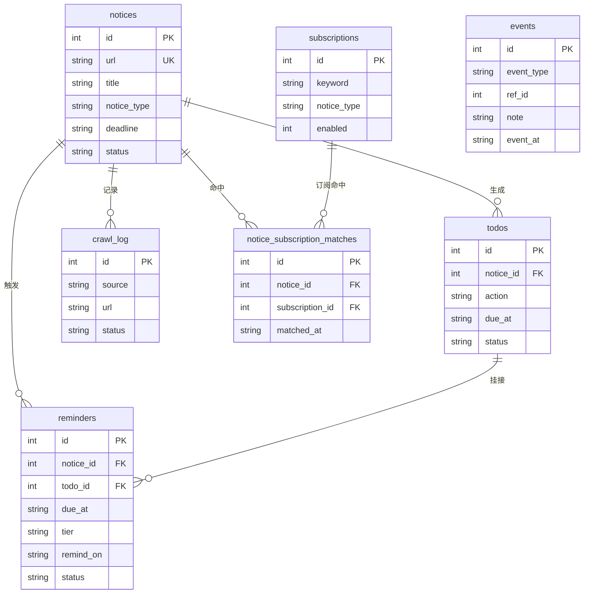

# 数据模型设计

## 1. SQLite 表结构

### 1.1 notices（通知表）

```sql
CREATE TABLE notices (
    id INTEGER PRIMARY KEY AUTOINCREMENT,
    url TEXT UNIQUE NOT NULL,           -- 通知详情页 URL（去重依据）
    source TEXT NOT NULL,               -- 来源：scuec/cxcy
    title TEXT NOT NULL,                -- 原始标题
    raw_content TEXT,                   -- 原始正文
    published_at TEXT,                  -- 发布时间（ISO 8601）
    crawled_at TEXT NOT NULL,           -- 抓取时间
    status TEXT DEFAULT 'raw',          -- raw/extracted/partial/failed
    content_hash TEXT,                  -- 正文内容指纹（SHA-256，模块 1.2 变更检测）
    -- 结构化提取结果（M2 提取后填充）
    notice_type TEXT,                   -- competition/lecture/registration/...
    target_audience TEXT,               -- 面向对象
    signup_method TEXT,                 -- 报名方式（QQ群/邮箱/扫码描述，自由文本）
    signup_url TEXT,                    -- 报名网页链接（仅当有真实 URL）
    location TEXT,                      -- 地点
    location_type TEXT,                 -- online/offline/hybrid
    deadline TEXT,                      -- 截止时间（ISO 8601，解析器重算）
    deadline_raw TEXT,                  -- 截止时间原文片段（可溯源/校验）
    key_dates_json TEXT,                -- 其他重要时间点（JSON 数组）
    summary TEXT,                       -- 摘要
    extracted_at TEXT                   -- 提取时间
);

CREATE INDEX idx_notices_status ON notices(status);
CREATE INDEX idx_notices_deadline ON notices(deadline);
CREATE INDEX idx_notices_type ON notices(notice_type);
```

### 1.2 todos（待办表）

```sql
CREATE TABLE todos (
    id INTEGER PRIMARY KEY AUTOINCREMENT,
    notice_id INTEGER NOT NULL,          -- 关联通知
    action TEXT NOT NULL,                -- 待办内容，如"提交数学建模报名表"
    due_at TEXT,                         -- 截止时间
    status TEXT DEFAULT 'pending',       -- pending/done/skipped
    created_at TEXT NOT NULL,
    completed_at TEXT,
    FOREIGN KEY (notice_id) REFERENCES notices(id)
);

CREATE INDEX idx_todos_status ON todos(status);
CREATE INDEX idx_todos_due ON todos(due_at);
```

### 1.3 crawl_log（抓取日志）

```sql
CREATE TABLE crawl_log (
    id INTEGER PRIMARY KEY AUTOINCREMENT,
    source TEXT NOT NULL,
    total_discovered INTEGER,
    total_new INTEGER,
    total_skipped INTEGER,              -- 已存在且正文未变更
    total_changed INTEGER,              -- 已存在但正文已变更（模块 1.2）
    total_failed INTEGER,
    errors TEXT,
    crawled_at TEXT NOT NULL
);
```

### 1.4 subscriptions（订阅表，W3 模块 3.1）

```sql
CREATE TABLE subscriptions (
    id INTEGER PRIMARY KEY AUTOINCREMENT,
    keyword TEXT NOT NULL,              -- 订阅词
    notice_type TEXT,                   -- 关注的通知类型（NULL = 不限类型）
    enabled INTEGER DEFAULT 1,          -- 1 启用 / 0 停用
    created_at TEXT NOT NULL
);

CREATE INDEX idx_subscriptions_enabled ON subscriptions(enabled);
```

### 1.5 notice_subscription_matches（订阅命中关系，W3 模块 3.1）

```sql
CREATE TABLE notice_subscription_matches (
    id INTEGER PRIMARY KEY AUTOINCREMENT,
    notice_id INTEGER NOT NULL,          -- 关联通知
    subscription_id INTEGER NOT NULL,    -- 命中的订阅
    matched_at TEXT NOT NULL,
    UNIQUE(notice_id, subscription_id),  -- 幂等：同一对只保留一条
    FOREIGN KEY (notice_id) REFERENCES notices(id),
    FOREIGN KEY (subscription_id) REFERENCES subscriptions(id)
);

CREATE INDEX idx_nsm_notice ON notice_subscription_matches(notice_id);
CREATE INDEX idx_nsm_subscription ON notice_subscription_matches(subscription_id);
```

> **设计要点（确定性匹配引擎）**
> - 匹配为纯规则、不用 LLM：订阅词对通知的 `title` / `summary` 做大小写不敏感的
>   子串匹配；订阅限定了 `notice_type` 时还需类型完全相等。
> - 抓取插入/内容变更后（`crawler/web_crawler.py`）、提取成功后
>   （`services/notice_service.py`）都会调用 `match_notice()` 增量维护命中关系。
> - 新增/修改订阅后调用 `match_all_notices()` 全库回填，保证已有通知也被标记。
> - 删除通知 / 删除来源 / 删除状态、停用订阅、修改订阅时都会级联清理命中关系，
>   避免陈旧数据。

### 1.6 reminders（截止提醒表，W3 模块 3.2）

```sql
CREATE TABLE reminders (
    id INTEGER PRIMARY KEY AUTOINCREMENT,
    notice_id INTEGER NOT NULL,          -- 关联通知（恒非空：通知路与待办兜底路都带）
    todo_id INTEGER,                     -- 关联待办（有待办时挂上，可空，仅展示用）
    due_at TEXT NOT NULL,                -- 截止时间（复用 notice.deadline / todo.due_at）
    tier TEXT NOT NULL,                  -- 提醒档位：3d / 1d
    remind_on TEXT NOT NULL,             -- 触发日期 YYYY-MM-DD（幂等键）
    status TEXT DEFAULT 'pending',       -- pending / read / ignored
    created_at TEXT NOT NULL,
    read_at TEXT,
    UNIQUE(notice_id, tier, remind_on),  -- 幂等：同一天同一对象同一档位不重复
    FOREIGN KEY (notice_id) REFERENCES notices(id),
    FOREIGN KEY (todo_id) REFERENCES todos(id)
);

CREATE INDEX idx_reminders_status ON reminders(status);
CREATE INDEX idx_reminders_due ON reminders(due_at);
```

> **设计要点（截止提醒）**
> - 以通知为对象粒度：每条有截止时间的通知只生成一条提醒；存在待处理待办时
>   同时挂上 `todo_id`（UI 可展示待办动作文案）。因待办 `due_at` 生成时被强制
>   等于通知 `deadline`，同一截止时间不会重复提醒。
> - 幂等键只用恒非空的 `notice_id`（+`tier`+`remind_on`）：SQLite 将 UNIQUE 列中的
>   `NULL` 视为互异，若把可空的 `todo_id` 纳入唯一键，无待办的提醒会失去幂等性。
> - 生成链路不依赖 Streamlit：调度器独立进程（scheduler.py 的 `reminder` job，
>   每日 03:00）调用 `services/reminder_service.scan_reminders()` 扫描写入，UI 只读。
> - 数据卫生：待办完成/跳过后其待处理提醒自动置 `read`；删除通知 / 来源 / 状态、
>   删除单条待办时级联删除关联提醒。

### 1.7 events（事件埋点表，W4 模块 4.1）

```sql
CREATE TABLE events (
    id INTEGER PRIMARY KEY AUTOINCREMENT,
    event_type TEXT NOT NULL,          -- 事件类型：page_view / qa_ask / todo_generate / todo_done / service_button_click
    ref_id INTEGER,                    -- 关联对象 id（notice_id / todo_id / 服务 key），可空
    note TEXT,                         -- 备注（页面标识 / 问题文本 / 服务名），可空
    event_at TEXT NOT NULL             -- 事件时间（ISO 8601）
);

CREATE INDEX idx_events_type ON events(event_type);
CREATE INDEX idx_events_at ON events(event_at);
```

> **设计要点（埋点）**
> - **纯追加事件日志**：不建外键、不做级联清理——删除通知/待办不影响历史事件，
>   `ref_id` 只是普通整数，允许悬空引用。
> - **确定性代码、纯本地落库**：`services/tracking_service.track_event()` 每次自开
>   独立短连接写入，整体 try/except 兜底，异常只记日志返回 False，绝不阻塞主流程。
> - **页面访问按会话去重**：Streamlit 每次交互都会整体重跑脚本，页面顶部用
>   `st.session_state` 标志保证每会话每页只记一次 page_view，避免 rerun 噪声。
> - **服务按钮点击**（门控 #1 一键下单数据源）：`pages/6_服务市场.py` 的假「下单」
>   按钮点击记录 `service_button_click`（ref_id=服务 key，note=服务名）并弹演示版提示。
> - 消费方：W4 周报（模块 4.3 汇总打开频率/问答次数/待办点击率/服务点击）。

## 2. Pydantic 模型

### 2.1 通知提取结果

```python
from pydantic import BaseModel
from typing import Literal, Optional

# 通知类型枚举（10 类）
NoticeType = Literal[
    "competition",   # 竞赛
    "lecture",       # 讲座
    "registration",  # 报名/培训/选课
    "scholarship",   # 奖学金
    "administrative",# 行政事务（放假/注册/缴费）
    "recruitment",   # 招聘/实习
    "policy",        # 政策/资讯
    "result",        # 结果公示
    "news",          # 动态/新闻
    "other",         # 其他
]

class KeyDate(BaseModel):
    """一个重要的日期/时间点（如报名截止、初赛、决赛）。"""
    label: str             # 时间点含义，如"报名截止""初赛"
    date_raw: str          # 原文时间片段，如"5月23日12:00-17:00"
    datetime: str | None   # 规范化 ISO 8601（后处理填充）

class NoticeExtraction(BaseModel):
    """LLM 结构化提取输出"""
    notice_type: NoticeType
    title: str
    target_audience: str | None = None
    signup_method: str | None = None   # 报名方式自由文本（QQ群/邮箱/扫码）
    signup_url: str | None = None      # 报名网页链接（仅当有真实 URL）
    location: str | None = None
    location_type: Literal["online", "offline", "hybrid"] | None = None
    deadline_raw: str | None = None    # 截止时间原文片段（防幻觉/可校验）
    deadline: str | None = None        # ISO 8601（Python 解析器以 deadline_raw 重算为准）
    key_dates: list[KeyDate] = []
    summary: str | None = None
```

> **设计要点**
> - `deadline_raw` + `deadline` 双字段：LLM 只负责从原文中定位时间片段，
>   年份推断与 ISO 规范化由 `core/date_utils.py` 的解析器完成（比 LLM 直接
>   输出 ISO 更可靠，且可校验防幻觉）。无年份时用 `published_at` 年份，早于
>   发布日则用下一年。
> - `signup_method` 为自由文本：真实通知里 QQ 群号、邮箱、扫码占绝大多数，
>   URL 是少数，所以单独一个 URL 字段不够。
> - 状态三态：`extracted`（行动型且有行动字段）/ `partial`（政策/新闻/结果公示等
>   非行动型，无行动字段）/ `failed`（LLM 调用本身失败）。
> - 行动型类型 = competition/lecture/registration/scholarship/administrative/recruitment；
>   非行动型 = policy/result/news/other。

### 2.2 待办项

```python
class TodoItem(BaseModel):
    """单条待办"""
    action: str           # 待办内容
    due_at: str | None    # 截止时间
    priority: str = "normal"  # high/normal/low

class TodoList(BaseModel):
    """待办清单"""
    items: list[TodoItem]
```

### 2.3 通知卡片（前端展示）

```python
class NoticeCard(BaseModel):
    """前端展示用"""
    id: int
    title: str
    notice_type: str
    deadline: str | None
    location: str | None
    target_audience: str | None
    signup_method: str | None
    signup_url: str | None
    summary: str
    published_at: str | None
    source: str
    url: str
```

## 3. 向量库结构（Chroma）

```python
collection = chroma_client.create_collection(
    name="notices",
    metadata={"hnsw:space": "cosine"}
)

# 每条文档：
{
    "id": "notice_{notice_id}_chunk_{chunk_idx}",
    "embedding": [...],  # 384 维
    "document": "通知正文片段",
    "metadata": {
        "notice_id": 123,
        "title": "通知标题",
        "notice_type": "competition",
        "source": "scuec/cxcy"
    }
}
```

## 4. ER 关系


