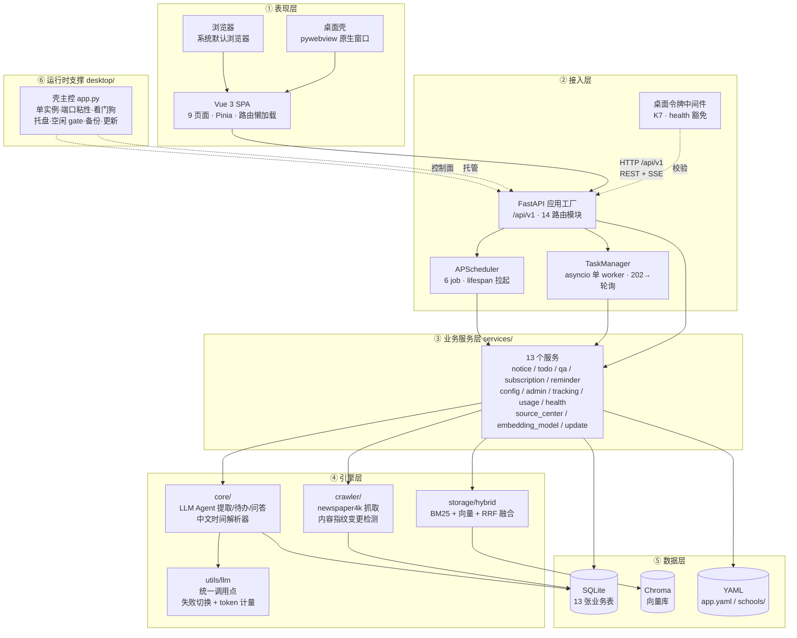
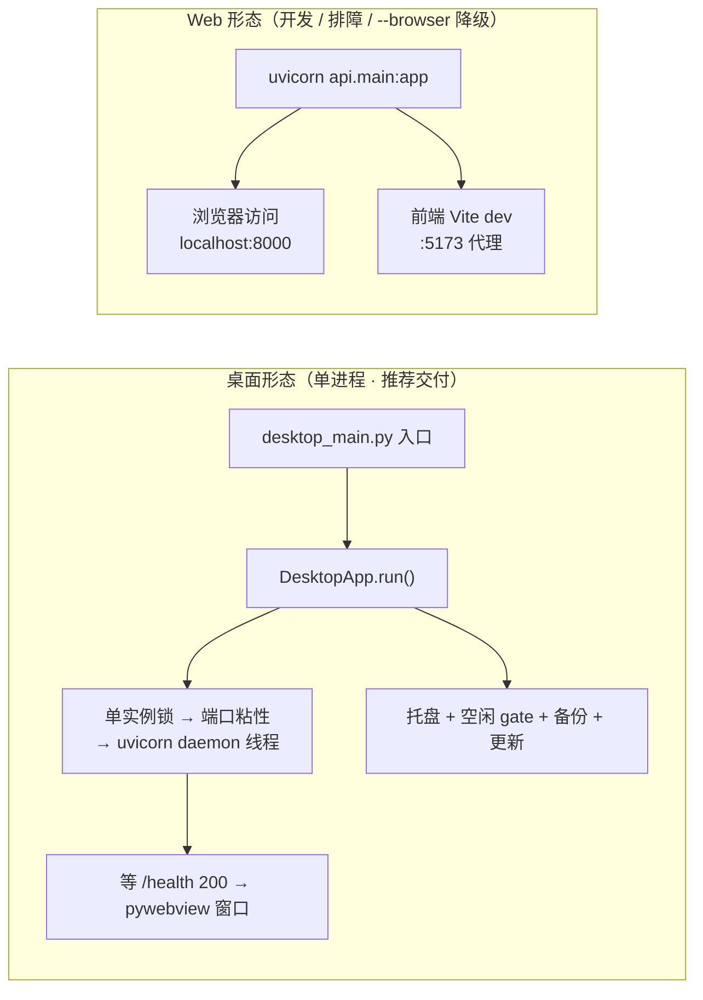
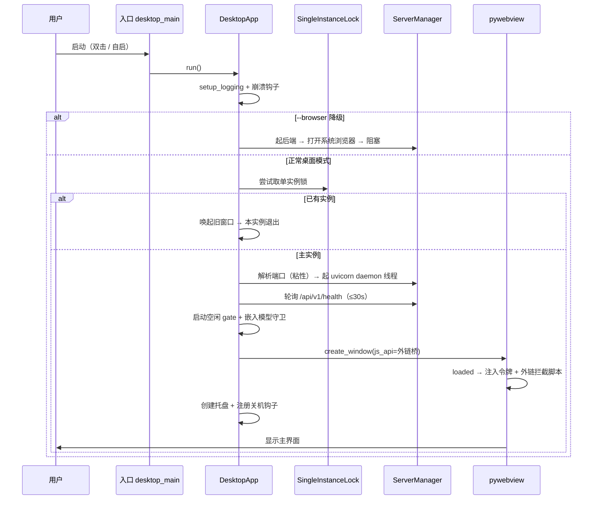
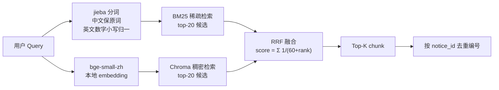
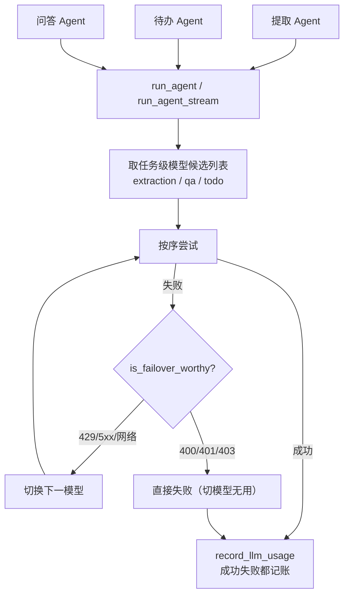
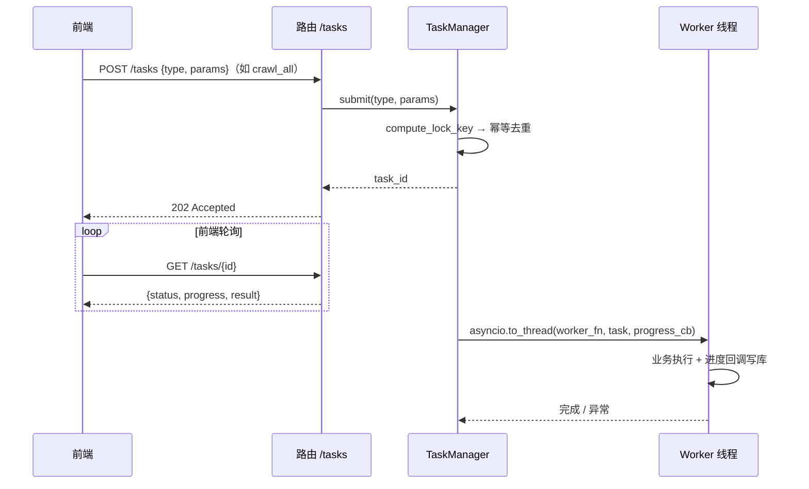
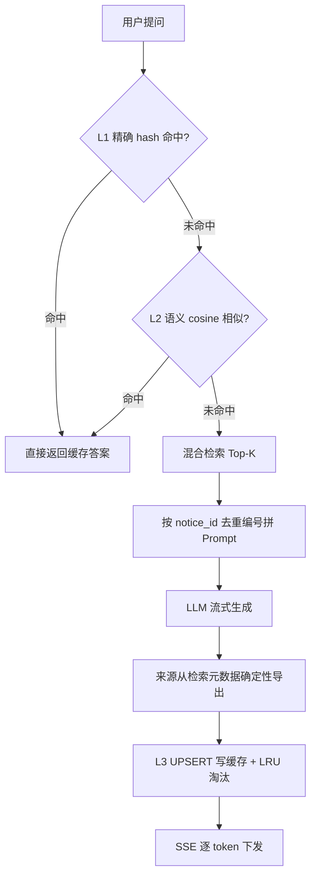
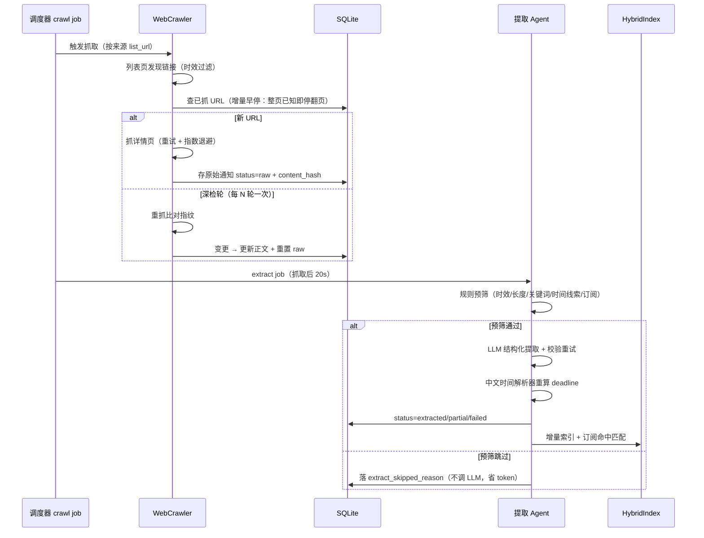
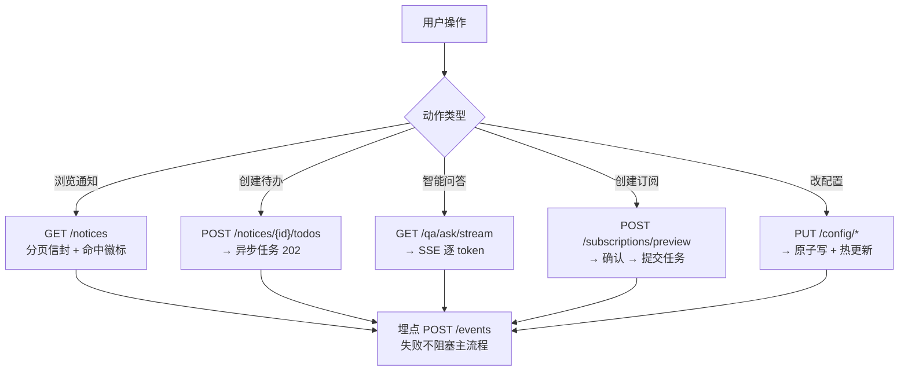
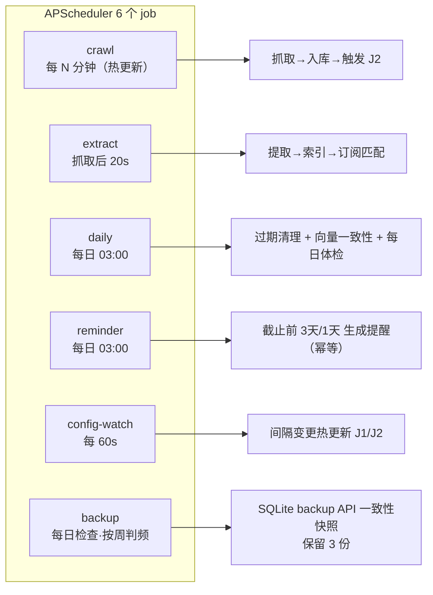

# 系统架构与设计文档

> 本文档是**面向全局的架构总览**，回答「系统由哪些部分组成、它们如何协作、数据怎么流动」。
> 更细的字段级契约见 [DATA-MODEL.md](DATA-MODEL.md)，接口清单见 [ARCHITECTURE.md](ARCHITECTURE.md) §7，
> 桌面改造的批次决策见 [DESKTOP-UPGRADE.md](DESKTOP-UPGRADE.md)。

## 一、系统定位与设计哲学

### 1.1 一句话定位

把散落在学校各网站的通知，经「抓取 → LLM 结构化提取 → 向量索引」转化为**可检索、可订阅、可待办、可提醒**的结构化信息，并以**原生桌面应用**或 **Web 服务**两种形态交付。

### 1.2 三条设计哲学

| 原则 | 含义 | 落地证据 |
| --- | --- | --- |
| **确定性优先** | 能用规则解决的绝不交给 LLM | 提取前置规则预筛、自研中文时间解析器、订阅纯规则匹配、问答来源从检索元数据导出（杜绝幻觉引用） |
| **限制模型犯错空间** | 把 LLM 不确定性包在可靠软件边界内 | `output_type` 硬约束采样 + 校验失败回传重试（≤2 次）+ 模型失败切换 + 三层问答缓存 |
| **评估闭环** | 每个 Agent 环节都有可复现度量 | 黄金集 24/24（提取）、100%（时间解析）、20 题检索集、43 个离线验收脚本 |

### 1.3 架构分层总览



> **依赖方向单向向下**：表现层不直连数据层；路由层只做「校验 + 调服务 + 序列化」的薄转发；
> 业务服务层返回统一 dict 契约，上层不感知存储实现。`storage/` 已抽象，可平替 PostgreSQL。

## 二、双形态运行时：桌面版与 Web 版

同一套后端代码（75 个 REST 端点**零改动**）被两种形态复用，差异只在**进程编排**：



| 维度 | 桌面形态 | Web 形态 |
| --- | --- | --- |
| 启动方式 | 双击 exe / 开机自启（`--autostart`） | 命令行 `uvicorn api.main:app` |
| 界面容器 | pywebview（WebView2）原生窗口 | 系统默认浏览器 |
| 后端托管 | `desktop/server.py` daemon 线程 `uvicorn.Server.run()` | 独立进程 / uvicorn 前台 |
| 端口 | **粘性**（`data/runtime.json` 记住上次端口，避免 localStorage 丢失） | 8000 固定 / 可指定 |
| 安全 | 启动令牌 `X-Desktop-Token`（K7 中间件） | 无令牌（默认关闭校验） |
| 关闭语义 | 默认最小化到托盘（可配 `close_action=exit`） | 进程结束即关闭 |
| 崩溃恢复 | 看门狗重建 Server 实例 + 崩溃转储 | 手动重启 |

> **降级兜底**：`--browser` 参数让桌面壳跳过 webview、改用系统浏览器（同时关令牌校验），
> 用于 WebView2 缺失或渲染异常时的排障路径。`--no-tray` 则回滚到「关闭即退出」语义。

### 2.1 桌面壳启动序列



### 2.2 桌面壳退出序列（K5 统一路径）

四条触发路径（托盘退出 / 窗口关闭 / 系统关机 / 看门狗）全部收敛到 `_do_exit()`，**幂等**：

```
写窗口几何 → server.should_exit=True + join(10s)
  → scheduler.stop()（显式兜底）→ pystray.stop()
  → 释放单实例锁 → 停空闲 gate → 停嵌入守卫 → 停关机钩子 → sys.exit(0)
```

> **关键约束**：`window.destroy()` 也会触发 `closing` 事件，退出时必须先置 `_exiting=True` 放行，
> 否则关闭被取消、`webview.start()` 永不返回，进程卡死。

## 三、核心模块职责

### 3.1 分层模块清单

| 层 | 目录 | 职责 | 关键文件 |
| --- | --- | --- | --- |
| 表现层 | `frontend/src/` | 9 页面 SPA、Pinia 状态、路由守卫埋点、任务轮询 | `views/` `stores/` `composables/useTaskPoll.ts` |
| 契约层 | `frontend/openapi.json` | **单一事实源**，`openapi-typescript` 生成 `types.ts`（零漂移） | `src/api/types.ts` |
| 接入层 | `api/` | 应用工厂、路由转发、异步任务、调度器托管、令牌校验 | `main.py` `tasks/manager.py` `desktop_token.py` |
| 业务层 | `services/` | 13 个服务，返回统一 dict 契约 | `notice_service.py` `qa_service.py` |
| Agent 层 | `core/` | 提取/待办/问答三类 Agent + 中文时间解析 | `extractor.py` `todo.py` `qa.py` `date_utils.py` |
| 抓取层 | `crawler/` | newspaper4k 列表发现 + 详情提取 + 内容指纹 | `web_crawler.py` `base.py` |
| 存储层 | `storage/` | SQLite（13 表）+ Chroma + BM25/RRF | `db.py`(1866 行) `vectorstore.py` `hybrid.py` |
| 配置层 | `config/` | Pydantic 模型 + YAML 三层 fallback + 原子写 | `store.py` `schema.py` `schools/*.yaml` |
| 工具层 | `utils/` | LLM/Embedding 唯一调用点、应用路径解析 | `llm.py` `embedding.py` `app_paths.py` |
| 壳层 | `desktop/` | 单实例、端口、托盘、看门狗、备份、更新、空闲 gate | `app.py` `server.py` `updater.py` |

### 3.2 关键子系统

**① 搜索引擎（`storage/`）** — 双路检索 + 融合



> **BM25 语料与向量库同源**：直接从 Chroma `collection.get()` 拉取全部 chunk 构建，
> 杜绝「重新切分导致两路语料漂移」。过期策略三档（none / decay / filter）两路共用对齐。

**② LLM 调用中枢（`utils/llm.py`）** — 全项目唯一出口



**③ 异步任务系统（`api/tasks/`）** — 长耗时操作不阻塞 Web



> **为什么单 worker 串行**：SQLite 单写者 + 配置写权唯一 + Chroma 单 collection，
> 串行是**天然免费的并发保护**。任务锁 `(type, lock_key)` 保证重复点击返回同一 task_id（202 而非 409）。

**④ 问答链路（`core/qa.py` + `services/qa_service.py`）** — 三层缓存 + SSE 流式



## 四、端到端数据流

### 4.1 主链路：抓取 → 提取 → 索引



**成本控制三层节流**：① 增量抓取（不重抓已入库详情）② 提取规则预筛（不通过不调 LLM）③ 模型失败切换。
全链路 token 消耗统一经 `utils/llm.py` 记账，可审计、可聚合、可做预算。

### 4.2 用户交互链路



### 4.3 自动化链路（调度器 6 job）



> **幂等与恢复**：所有 job 运行记录落 `scheduler_log`（含连续失败计数），重启可恢复；
> `notices.url UNIQUE` 保证崩溃后已抓 URL 不重复抓取。暂停支持两级——全局 `pause()`
> 与仅挂起重活 `pause_heavy()`（空闲 gate 用，不影响凌晨体检/提醒）。

## 五、关键设计决策

### 5.1 数据一致性

| 问题 | 方案 |
| --- | --- |
| **RAG 污染（幽灵结果）** | 三层防线：① 删通知时按 `notice_id` **级联删向量**（按真实 chunk id 删，规避 where 语义不确定）② 重建索引先 `delete_collection()` ③ 每日体检自动一致性校验清理 |
| **配置并发写** | 写入权**唯一归后端 API 进程**；调度器/CLI 只读，`force_reload` 后重载 |
| **配置损坏** | 三层 fallback（`app.yaml` → `.bak` → 内置默认）+ 三步原子写（`.tmp → .bak → os.replace`） |
| **WAL 未 checkpoint** | 备份必须用 SQLite `backup()` API 而非裸拷贝主库（裸拷会漏 WAL 中未落盘数据） |
| **事件循环被阻塞** | async 中的同步阻塞（requests / PyTorch / Chroma 写）一律 `asyncio.to_thread` 包装 |

### 5.2 为什么这样选

| 决策 | 选择 | 理由 | 不选 X |
| --- | --- | --- | --- |
| 后端框架 | FastAPI + uvicorn | 异步原生，契合 SSE / 异步任务；自动生成 OpenAPI | Flask/Django 同步 WSGI 对长连接弱 |
| Agent 框架 | OpenAI Agents SDK | `output_type` 硬约束采样空间，适配字段提取 | LangGraph 对本任务边界清晰场景是过度设计 |
| 向量库 | Chroma（嵌入式） | 单机万级 chunk 零运维 | Milvus/Weaviate 重型分布式过度设计 |
| 检索 | BM25 + 向量 + RRF | 中文专名（比赛缩写/英文混排）稀疏召回互补 | 纯向量对中文专名召回不足 |
| 数据存储 | SQLite 13 表 | 单文件零依赖，单写者模型足够 | PostgreSQL 个人规模增加运维成本 |
| 桌面壳 | pywebview + 自研胶水层 | 后端 68 端点零改动，壳增量仅 44.6MB | Electron 体积大；Tauri 需重写前端集成 |
| 前后端契约 | openapi-typescript | openapi.json 唯一事实源，类型零漂移 | 手写类型易漂移 |

### 5.3 可扩展性预留

| 方向 | 现状 | 扩展点 |
| --- | --- | --- |
| 多学校适配 | `config/schools/<code>.yaml` | 新增学校零代码，改 `active_school` |
| 多用户鉴权 | `api/deps.py` 鉴权占位 | 换 JWT/OAuth，业务路由零改动 |
| 数据库平替 | `storage/` 已抽象 | 换 PostgreSQL 只改 storage 实现 |
| 站外推送 | 提醒/订阅数据模型就绪 | 扩展邮件 / 微信 / 桌面通知 |
| 多端接入 | 契约驱动 + 令牌中间件 | APP 端复用同一 `/api/v1` |

## 六、部署与数据目录

### 6.1 数据目录三态（`utils/app_paths.py`）

| 模式 | 触发条件 | 数据位置 |
| --- | --- | --- |
| `dev` | 源码运行 | 项目根 `data/` |
| `portable` | 便携版（exe 同级有 `data/` 或标记） | exe 同级 `data/` |
| `installed` | 安装版 | `%LOCALAPPDATA%` 下应用目录 |

> 三态决定 SQLite、Chroma、日志、备份、WebView2 user-data 的落点；迁移向导只做**只读复制**，不删源。

### 6.2 数据资产

| 资产 | 位置 | 说明 |
| --- | --- | --- |
| 业务库 | `data/notices.db` | SQLite 13 表，WAL + NORMAL 同步 |
| 向量库 | Chroma 持久化目录 | 与 SQLite 通知 ID 集合须一致 |
| 日志 | `data/logs/` | 滚动日志 + `crash/` 崩溃转储 |
| 备份 | `data/backups/` | `backup()` API 快照，保留 3 份，`.last_backup` 记时间戳 |
| 运行时 | `data/runtime.json` | 端口粘性 |
| 设置 | settings.json | 窗口几何、自启、关闭行为、空闲阈值 |

## 七、测试与质量

| 维度 | 内容 |
| --- | --- |
| 离线验收 | 43 个 `test_*.py`（爬虫/检索/任务/缓存/并发/崩溃恢复/桌面壳） |
| 评估脚本 | `evaluate_extraction.py`（24/24）、`evaluate_retrieval.py`（20 题）、`evaluate_hybrid.py`、`evaluate_todo.py` |
| 一致性 | `check_vector_consistency.py`（退出码 0=一致）、`reproduce_pollution.py`（污染复现） |
| 测试约定 | **临时库一律 `tempfile.mkdtemp()`**，绝不用 `data/`（沙箱删除被拦截 → 残留致 UNIQUE 失败） |
| 性能基线 | 6 源增量一轮 ≈ 3.5s；2 条并发提取 3.21s（串行 5.88s） |

## 八、文档地图

| 文档 | 定位 |
| --- | --- |
| **本文档 SYSTEM-DESIGN.md** | 全局架构视图：分层、模块、数据流、决策 |
| [ARCHITECTURE.md](ARCHITECTURE.md) | 模块划分细节 + API 端点清单 + 配置项全表 |
| [DATA-MODEL.md](DATA-MODEL.md) | 13 张表结构 + Pydantic 模型 |
| [PRD.md](PRD.md) | 产品需求、用户故事、交付状态 |
| [RAG-POLLUTION.md](RAG-POLLUTION.md) | RAG 污染防护专项 |
| [DESKTOP-UPGRADE.md](DESKTOP-UPGRADE.md) | 桌面化改造批次决策（K1–K9 关键点） |
| [DISTRIBUTION.md](DISTRIBUTION.md) | 分发、签名、WebView2 检测 |
| [ROADMAP.md](ROADMAP.md) | 开发路线图与里程碑 |
